Mr. Robot Writeups
===

*IP Hackbox yang akan digunakan pada writeup ini mungkin akan berbeda untuk setiap orang*

Nmap
---

Hal yang pertama yang perlu dilakukan adalah *fingerprinting* atau mencari port apa saja yang terbuka dari IP korban

Dalam hal ini, kita akan melakukan scanning dengan Nmap

```bash
nmap -sV -T4 192.168.30.115
```

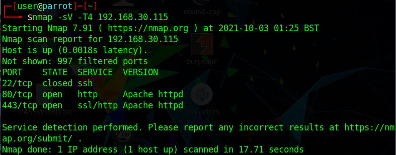

Terdapat 3 port yang terbuka. Port 22 untuk SSH dan port 80 & 443 untuk webserver.

Karena kita belum mengetahui password dari sistem ini, kita akan mengecek webservernya terlebih dahulu.

Gobuster
---

Saat kita mengakses webserver. Kita disugukan dengan tampilan "terminal" yang sebenarnya tidak bermakna apa-apa.

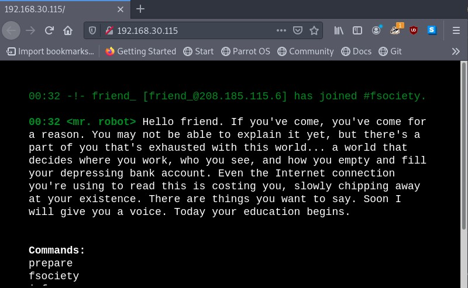

Karena tampilan website yang tidak memberikan *clue* apa-apa, maka saya mencoba untuk melakukan scanning directory webserver menggunakan **gobuster**.

```bash
gobuster dir -u http://192.168.30.115 -w /usr/share/wordlists/dirb/common.txt -z
```

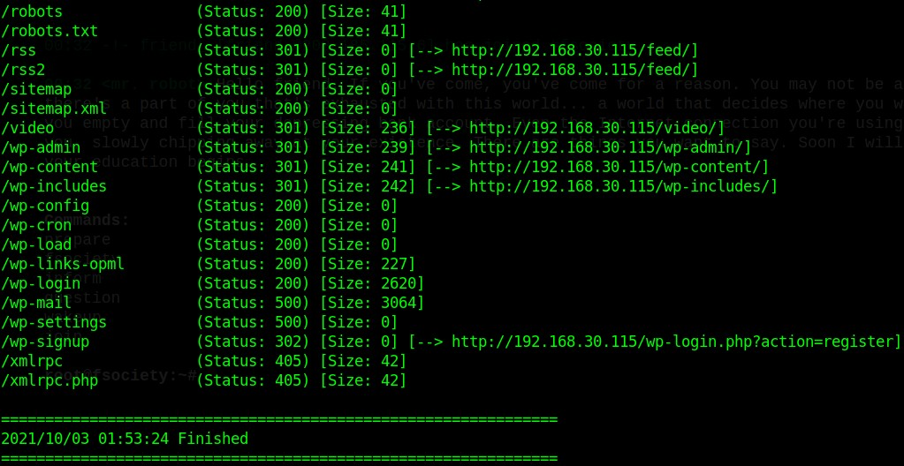

Setelah melakukan scanning, kita menemukan bahwa terdapat file robots.txt yang memberikan informasi menarik.

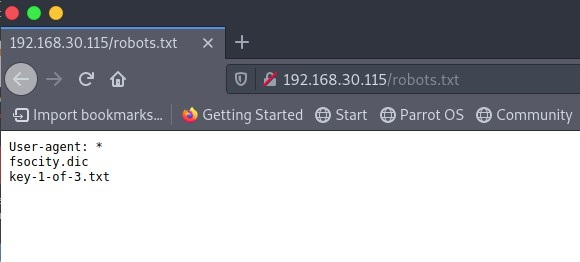

Key Pertama
---

Dengan mengakses `/key-1-of-3.txt`, terdapat key yang kita butuhkan untuk menyelesaikan *hacking challenge* ini

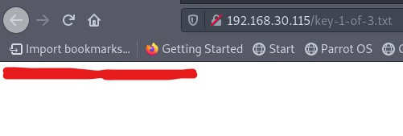

Kita telah mendapatkan key. Saatnya untuk mencari key selanjutkan.

Wpscan
---

Saat melakukan scanning dengan **gobuster**, kita dapat melihat bahwa website ini menggunakan wordpress. Terdapat directory bernama `/wp-admin` yang merupakan halaman login admin untuk wordpress.

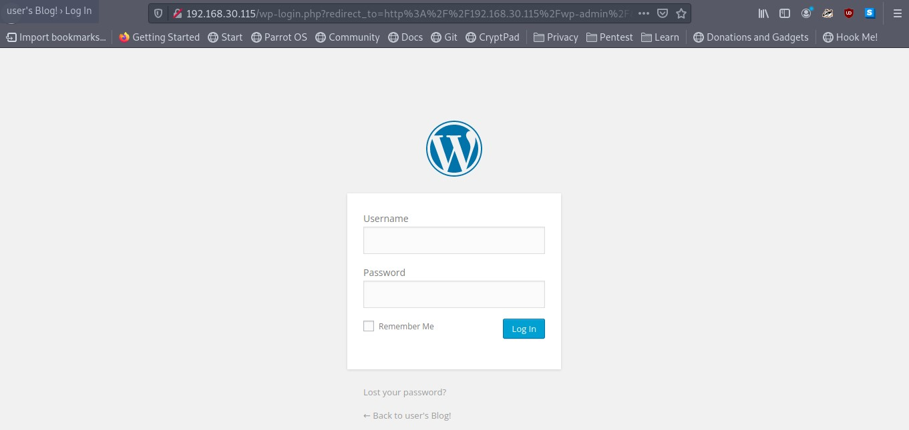

Sebelumnya kita menemukan file lain yang ada di `robots.txt` yaitu `fsocity.dic`. File tersebut merupakan wordlist yang mungkin kita perlukan untuk melakukan bruteforce ke login page wordpress.

Saat mencoba username secara acak, error message yang ditampilkan adalah `username invalid`. Tetapi saat mencoba dengan username **Elliot**, terdapat error message yang berbeda.

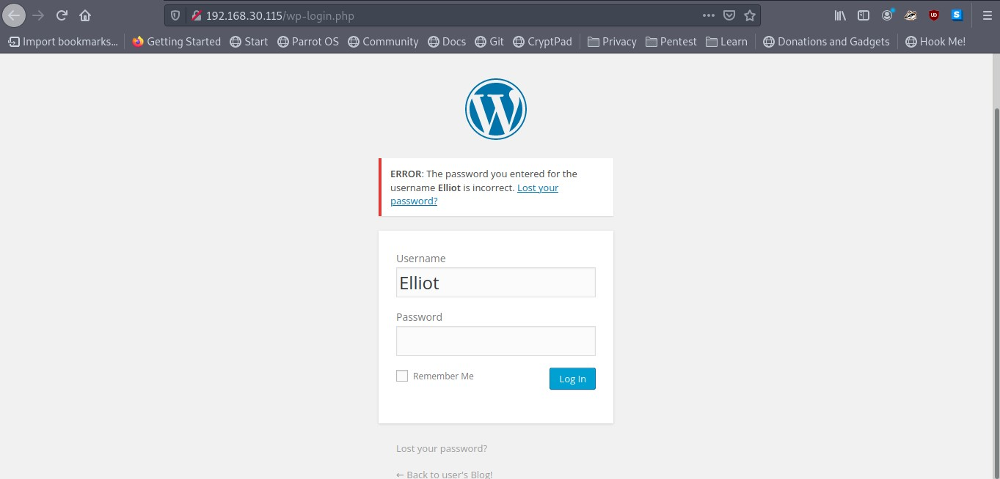

Karena kita telah mengetahui usernamenya adalah **Elliot**, maka langkah selanjutnya adalah melakukan bruteforce dengan file wordlist `fsocity.dic`.

Untuk bruteforce, kita akan menggunakan **wpscan**

```bash
wpscan --url 192.168.30.115 --wp-content-dir wp-admin --usernames Elliot --passwords fsocity.dic
```

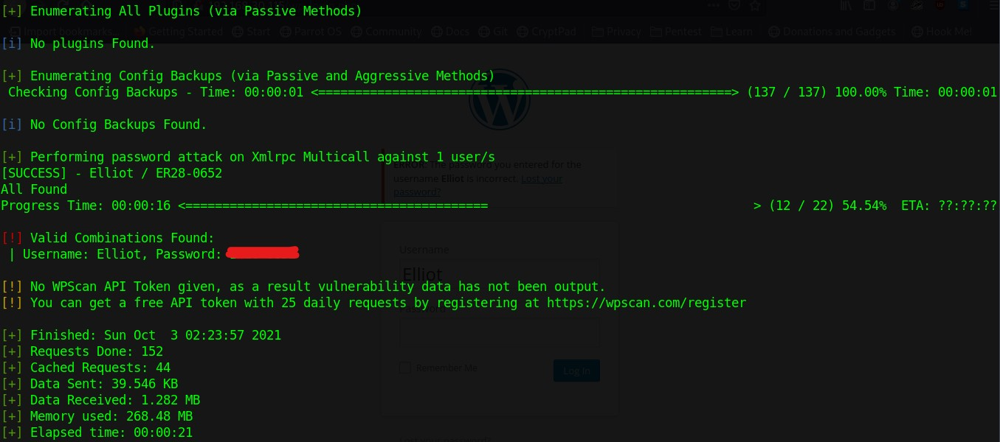

Kita telah menemukan passwordnya, waktunya untuk login.

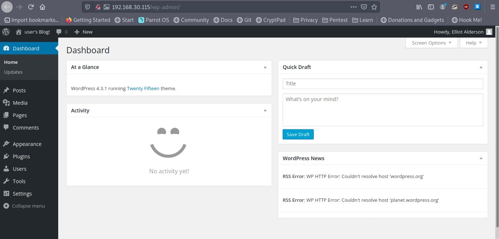

Kita masuk ke dalam dashboard admin.

Reverse Shell
---

Setelah melakukan pencarian, kita dapat temukan bahwa kita dapat mengubah **code PHP** untuk website tersebut. Halaman ini dapat diakses pada `Appearance > Editor`.

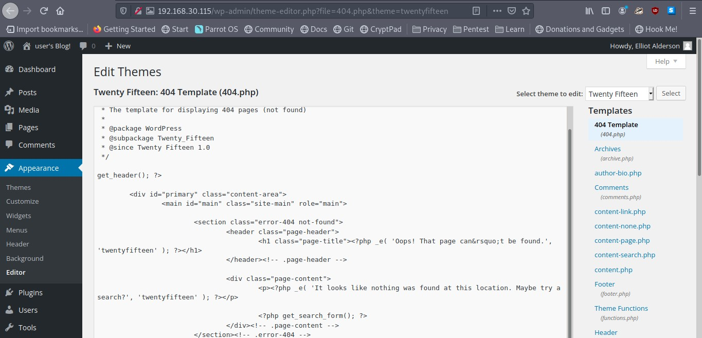

Kita akan mencoba untuk mengubah code PHP dari halaman `404.php` dengan menambahkan **reverse shell**.

Kita akan menggunakan code reverse shell dari [link ini](http://pentestmonkey.net/tools/php-reverse-shell/php-reverse-shell-1.0.tar.gz).

Lalu, kita ubah isi dari file `404.php` dengan code reverse shell yang disesuaikan dengan IP dan PORT yang akan kita gunakan. Untuk mengupdate file tersebut, kita klik tombol `Update File`.

Kita meng-setup listener pada port 4444

Setelah itu, kita mengakses file `404.php` dan webserver nya akan terkoneksi dengan listener kita.

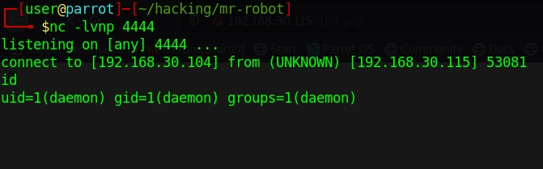

Kita telah mendapatkan shell dengan user sebagai `daemon`

Setelah mencari-cari, kita menemukan file menarik yang ada di `/home/robot` yaitu `key-2-of-3.txt`. Tetapi saat mencoba untuk melihat isinya terdapat error.

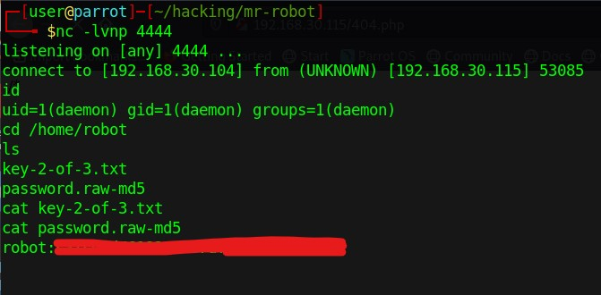

Namun terdapat file `password.raw-md5`. Isi dari file ini adalah username robot dan passwordnya dalam bentuk hash md5.

John the ripper
---

Untuk melakukan crack pada hash md5, kita akan menggunakan **john** dengan wordlist paling populer yaitu `rockyou.txt`

```bash
john -format=raw-md5 --wordlist=/usr/share/wordlists/rockyou.txt password.raw-md5
```

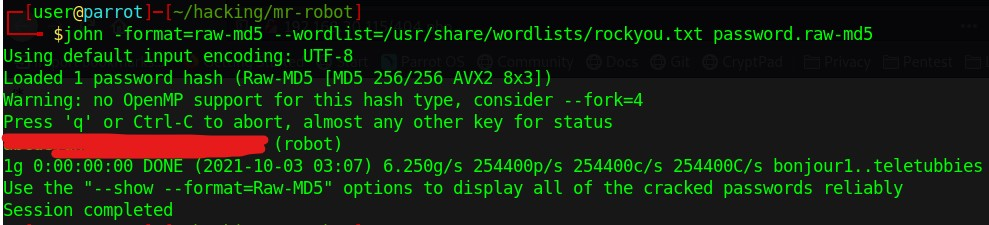

Akhirnya kita menemukan password nya.

Kita akan mencoba untuk mengganti user. Tetapi hal tersebut tidak dapat dilakukan karena kita tidak dalam mode terminal. Sehingga kita perlu membangkitkan terminal baru yang bisa digunakan untuk login ke user lain.

Salah satu cara membangkitkan terminal "cerdas" adalah

```bash
python -c 'import pty; pty.spawn("/bin/bash")'
```

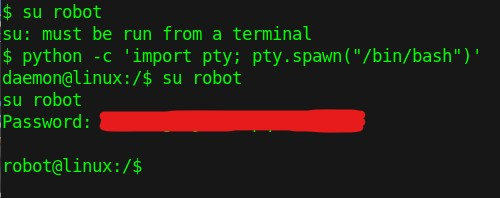

Key Kedua
---

Dengan mengakses `key-2-of-3.txt`, terdapat key yang kita butuhkan untuk menyelesaikan *hacking challenge* ini

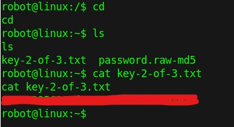

Kita telah mendapatkan key kedua. Saatnya untuk mencari key selanjutkan.

Privilage Escalation (with **SUID Exploit**)
---

Setelah mencoba beberapa command untuk melakukan Privilage Escalation. Kita menemukan hal menarik menggunakan command

```bash
find / -perm -u=s -type f 2>/dev/null
```

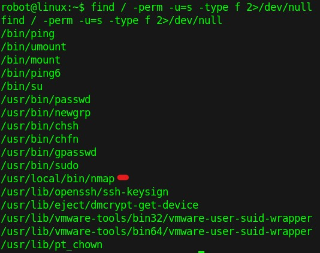

Terdapat program nmap yang dapat kita gunakan untuk Privilage Escalation.

Apa yang akan kita lakukan adalah menjalankan nmap yang nantinya akan memberikan kita akses terhadap root. Hal ini disebabkan kesalahan pada SUID bit yang telah diset.

Key Ketiga
---

Akan kita coba command berikut

```bash
nmap --interactive
```

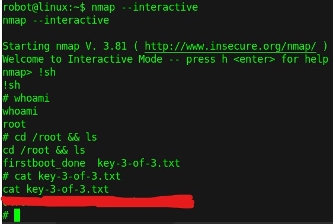

Akhirnya kita mendapatkan root. Kita juga berhasil menemukan key terakhir dari *hacking challenge* ini.

Semoga Writeup ini membantu kalian dalam mendalami dunia CTF kedepannya.
